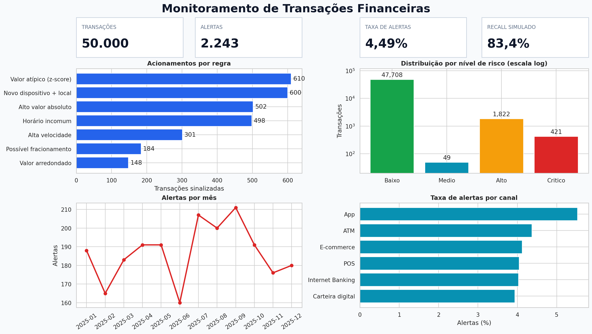
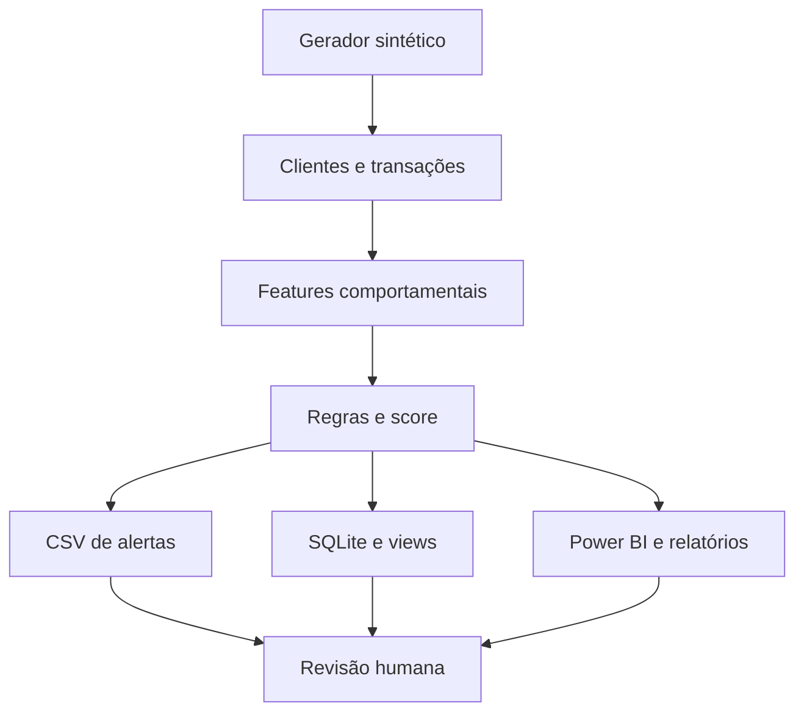

# Detecção de Transações Financeiras Suspeitas

[](https://github.com/Gmerick/deteccao-transacoes-financeiras-suspeitas/actions/workflows/ci.yml)
[](requirements.txt)
[](database/schema.sql)
[](powerbi/)

Projeto de portfólio que identifica movimentações fora do padrão com regras estatísticas e análise comportamental. A solução gera dados sintéticos, calcula atributos por conta, produz um score explicável, cria uma fila de alertas, persiste os resultados em SQL e entrega os componentes necessários para um dashboard no Power BI.

> **Importante:** alerta não significa fraude. Os dados e cenários deste repositório são inteiramente sintéticos. O projeto é educacional e demonstra priorização para revisão humana, não bloqueio automático ou acusação de pessoas.



## Resultado executivo

| Indicador | Resultado |
|---|---:|
| Contas sintéticas | 2.500 |
| Transações analisadas | 50.000 |
| Valor monitorado | R$ 34,16 milhões |
| Cenários suspeitos simulados | 2.000 |
| Alertas gerados | 2.243 |
| Taxa de alertas | 4,49% |
| Precisão | 74,36% |
| Recall | 83,40% |
| F1-score | 78,62% |
| Valor em transações alertadas | R$ 10,32 milhões |

Em uma operação real, a taxa de alertas representa carga de trabalho. O limiar deve equilibrar perdas evitadas, falsos positivos, experiência do cliente e capacidade dos analistas.

## Problema de negócio

Uma instituição processa milhares de movimentações e não consegue investigar todas manualmente. O objetivo é responder:

- quais transações estão mais distantes do comportamento habitual da conta;
- quais operações combinam múltiplos sinais de risco;
- quais contas, canais e horários concentram alertas;
- quanto valor financeiro está associado à fila de investigação;
- quais regras geram sinal útil e quais produzem ruído;
- como priorizar os casos sem tratar suspeita como confirmação.

## Tecnologias

| Tecnologia | Aplicação |
|---|---|
| Python | Orquestração, geração sintética, engenharia de atributos e relatórios |
| Pandas e NumPy | Janelas temporais, estatísticas por conta, regras e score |
| SQL / SQLite | Esquema analítico, índices, views e 12 consultas de negócio |
| Power BI | Modelo estrela, medidas DAX, tema e blueprint de quatro páginas |
| Matplotlib e Seaborn | Dashboard de referência e análise exploratória |
| GitHub Actions | Testes e execução completa do pipeline em cada alteração |

## Cenários simulados

| Padrão | Transações | Encontradas | Recall do cenário |
|---|---:|---:|---:|
| Valor atípico | 500 | 500 | 100,0% |
| Novo dispositivo e local | 350 | 350 | 100,0% |
| Horário incomum | 350 | 321 | 91,7% |
| Alta velocidade | 500 | 312 | 62,4% |
| Fracionamento | 300 | 185 | 61,7% |

O recall menor em sequências é esperado: uma regra em janela móvel só acumula evidência conforme as operações chegam. Isso permite discutir detecção por transação versus detecção por caso/conta.

## Regras explicáveis

| Regra | Condição | Pontos | Acionamentos |
|---|---|---:|---:|
| Valor atípico | z-score individual ≥ 3,5 | 30 | 610 |
| Alto valor absoluto | valor ≥ R$ 15.000 | 20 | 502 |
| Alta velocidade | ≥ 3 operações da conta em 1h | 25 | 301 |
| Horário incomum | 00h–04h e valor ≥ 2,5× a mediana | 20 | 498 |
| Novo dispositivo + local | dispositivo novo e UF divergente | 25 | 600 |
| Valor arredondado | múltiplo de R$ 1.000 | 10 | 148 |
| Possível fracionamento | faixa de valor + PIX + frequência em 24h | 20 | 184 |

O score soma os pontos e é limitado a 100. A partir de 20 pontos, a transação entra na fila.

## Arquitetura



## Estrutura do repositório

```text
.
├── data/
│   ├── raw/
│   │   ├── customers.csv
│   │   └── transactions.csv
│   └── processed/
│       ├── alerts_prioritized.csv
│       ├── monthly_monitoring.csv
│       ├── rule_summary.csv
│       └── transactions_scored.csv
├── database/
│   ├── analytics_queries.sql
│   ├── schema.sql
│   └── views.sql
├── docs/
│   ├── como_utilizar.md
│   ├── dicionario_dados.md
│   ├── metodologia.md
│   └── roteiro_entrevista.md
├── notebooks/
│   └── 01_analise_exploratoria.ipynb
├── powerbi/
│   ├── dashboard_layout.md
│   ├── data_model.md
│   ├── dax_measures.md
│   └── theme_fraud_detection.json
├── reports/
│   ├── dashboard_preview.png
│   ├── insights.md
│   └── metrics.json
├── src/
│   ├── config.py
│   ├── database.py
│   ├── detector.py
│   ├── generate_data.py
│   └── reporting.py
├── tests/
│   └── test_pipeline.py
├── requirements.txt
└── run_pipeline.py
```

## Como executar

Requer Python 3.10 ou superior.

```bash
git clone https://github.com/Gmerick/deteccao-transacoes-financeiras-suspeitas.git
cd deteccao-transacoes-financeiras-suspeitas
python -m venv .venv
```

No Windows PowerShell:

```powershell
.venv\Scripts\Activate.ps1
python -m pip install -r requirements.txt
python run_pipeline.py
python -m unittest discover -s tests -v
```

No Linux ou macOS:

```bash
source .venv/bin/activate
python -m pip install -r requirements.txt
python run_pipeline.py
python -m unittest discover -s tests -v
```

O pipeline recria os dados, pontua todas as transações, exporta a fila de alertas, gera gráficos e constrói o banco SQLite.

## SQL

Depois do pipeline:

```bash
sqlite3 database/fraud_detection.db
```

```sql
.headers on
.mode column
SELECT * FROM vw_executive_summary;
SELECT * FROM vw_alert_queue LIMIT 20;
SELECT * FROM vw_rule_performance ORDER BY flagged DESC;
.read database/analytics_queries.sql
```

O repositório contém 12 consultas, incluindo evolução mensal, contas prioritárias, combinações de regras, comportamento por hora e potencial fracionamento.

## Power BI

1. Importe `data/processed/transactions_scored.csv`.
2. Importe `rule_summary.csv` e `monthly_monitoring.csv` para auditoria.
3. Construa o modelo descrito em [`powerbi/data_model.md`](powerbi/data_model.md).
4. Adicione as medidas de [`powerbi/dax_measures.md`](powerbi/dax_measures.md).
5. Importe [`powerbi/theme_fraud_detection.json`](powerbi/theme_fraud_detection.json).
6. Monte as páginas conforme [`powerbi/dashboard_layout.md`](powerbi/dashboard_layout.md).

O `.pbix` não é versionado porque é um formato binário proprietário. Modelo, DAX, tema, dados e layout permanecem abertos, auditáveis e reproduzíveis.

## Principais insights

- 4,49% das operações foram direcionadas à análise, reduzindo o universo manual de 50.000 para 2.243 transações.
- 1.668 dos 2.000 cenários simulados foram recuperados.
- O App apresentou a maior taxa de alertas, 5,53%, influenciado por PIX e cenários de velocidade/fracionamento.
- Novo dispositivo com divergência geográfica teve 600 acionamentos, incluindo casos normais gerados aleatoriamente; contexto adicional seria necessário para reduzir falsos positivos.
- R$ 10,32 milhões passaram pela fila, mas esse valor não representa fraude confirmada nem perda evitável.
- O resultado apoia uma abordagem híbrida: regras explicáveis, revisão humana e aprendizado com o desfecho dos casos.

Leia a análise em [`reports/insights.md`](reports/insights.md).

## Como apresentar em uma entrevista

> Desenvolvi um projeto ponta a ponta para detectar transações financeiras suspeitas e priorizar investigações. Gerei uma base sintética com 50 mil transações de 2.500 contas e injetei cinco cenários de risco. Em Python e Pandas, criei atributos comportamentais, sete regras explicáveis e um score de zero a cem. A solução sinalizou 2.243 operações, com precisão de 74,36%, recall de 83,40% e F1 de 78,62% nos padrões simulados. Depois modelei a camada SQL e preparei o modelo, as medidas DAX e o dashboard para Power BI. O objetivo é reduzir o universo de análise e apoiar revisão humana, não declarar fraude automaticamente.

O roteiro de cinco minutos e respostas para perguntas técnicas estão em [`docs/roteiro_entrevista.md`](docs/roteiro_entrevista.md).

## Limitações e próximos passos

- calcular estatísticas somente com eventos anteriores, eliminando vazamento temporal;
- calibrar score pelo custo de falsos positivos e capacidade operacional;
- adicionar feedback das investigações e métricas de perdas evitadas;
- comparar regras com Isolation Forest e modelos supervisionados;
- usar grafos para relacionar contas, dispositivos, estabelecimentos e destinatários;
- monitorar drift, estabilidade das regras e vieses entre grupos;
- implementar detecção em streaming com baixa latência.

## Licença

Distribuído sob licença MIT. Consulte [`LICENSE`](LICENSE).

